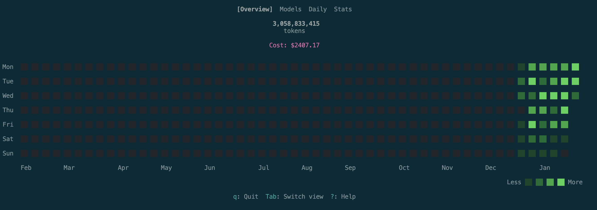

# toktrack

[English](README.md) | **한국어**

Rust로 만든 초고속 AI CLI 토큰 사용량 트래커. simd-json + ratatui 기반.



## 주요 기능

- **초고속 파싱** - simd-json 기반 (~2 GiB/s 처리량)
- **4개 TUI 뷰** - Overview, Models, Daily, Stats
- **CLI 명령어** - `daily`, `stats` (JSON 출력 지원)
- **데이터 보존** - 30일 삭제 전 자동 백업

## 설치

**권장 (Rust 불필요):**
```bash
npx toktrack
# 또는
bunx toktrack
```

**기타 방법:**
```bash
# Rust 개발자
cargo install toktrack

# 소스에서 설치
cargo install --git https://github.com/mag123c/toktrack

# 직접 다운로드
# → github.com/mag123c/toktrack/releases
```

## 사용법

### TUI 모드 (기본)

```bash
toktrack
```

### CLI 명령어

```bash
# 일별 사용량 요약
toktrack daily
toktrack daily --json

# 통계 보기
toktrack stats
toktrack stats --json

# 수동 백업
toktrack backup
```

### 키보드 단축키

| 키 | 동작 |
|-----|--------|
| `1-4` | 탭 직접 전환 |
| `Tab` / `Shift+Tab` | 다음 / 이전 탭 |
| `j` / `k` 또는 `↑` / `↓` | 위 / 아래 스크롤 |
| `?` | 도움말 토글 |
| `q` | 종료 |

## 지원하는 AI CLI

| CLI | 상태 | 데이터 위치 |
|-----|--------|---------------|
| Claude Code | ✅ MVP | `~/.claude/projects/` |
| OpenCode | 🔜 v1.1 | `~/.local/share/opencode/` |
| Codex CLI | 🔜 v1.2 | `~/.codex/sessions/` |
| Gemini CLI | 🔜 v1.3 | `~/.gemini/tmp/*/chats/` |

## 벤치마크

| 모드 | 처리량 |
|------|------------|
| 단일 파일 (simd-json) | ~1.0 GiB/s |
| 병렬 처리 (rayon) | ~2.0 GiB/s |

**실제 성능** (2,000+ 파일 / 2.9GB 데이터):

| 도구 | 시간 |
|------|------|
| ccusage (Node.js) | ~20초 |
| ccusage (캐시 사용) | ~7초 |
| **toktrack** | **< 500ms** |

## 데이터 보존

Claude Code와 Gemini CLI는 기본적으로 30일 후 세션 데이터를 삭제합니다.

toktrack은 첫 실행 시 자동으로 `~/.toktrack/cache/`에 데이터를 백업합니다.

Claude Code의 자동 삭제 비활성화:
```json
// ~/.claude/settings.json
{
  "cleanupPeriodDays": 9999999999
}
```

## 설정

```toml
# ~/.toktrack/config.toml

[cache]
enabled = true
backup_on_start = true

[tui]
theme = "green"  # green, teal, blue, pink, purple, orange
```

## 아키텍처

```
toktrack/
├── src/
│   ├── parser/      # simd-json JSONL 파싱
│   ├── services/    # 집계 및 파일 감시
│   ├── tui/         # ratatui 기반 터미널 UI
│   └── cli/         # 명령줄 인터페이스
```

## 개발

```bash
# 전체 검사 실행 (fmt + clippy + test)
make check

# 테스트 실행
cargo test

# 감시 모드로 실행
cargo watch -x test

# 벤치마크 실행
cargo bench

# 릴리스 빌드
cargo build --release
```

## 라이선스

MIT
