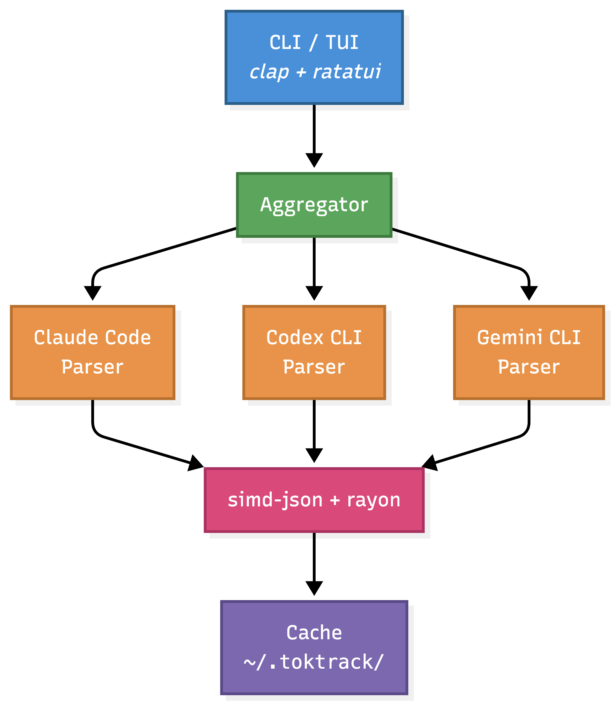

<p align="center">
  
</p>

<p align="center">
  <a href="https://github.com/mag123c/toktrack/actions/workflows/ci.yml"></a>
  <a href="https://www.npmjs.com/package/toktrack"></a>
  <a href="LICENSE"></a>
</p>

**English** | [한국어](README.ko.md)

> **⚠️ Did you know?** Claude Code **deletes your session data after 30 days** by default. Once deleted, your token usage and cost history are gone forever — unless you preserve them.

**The token & cost tracker that never loses your history.** Most tools re-read your CLI's session files on every run — so when Claude Code deletes them after 30 days, your cost history goes with them. toktrack keeps a **persistent cache**, so your history survives.

Track usage across **all your AI coding CLIs** — Claude Code, Codex CLI, Gemini CLI, Qwen Code, OpenCode, PI Agent, and Antigravity — in one dashboard. Built in Rust, so it stays fast even on huge histories (simd-json + rayon).


## Why toktrack?

| Problem | Solution |
|---------|----------|
| 🗑️ **Claude Code deletes data after 30 days** — your cost history disappears | 💾 **Persistent cache** — history survives even after the CLI deletes its files |
| 📊 **No unified view** — each CLI keeps its own separate data | 🎯 **One dashboard** — Claude Code, Codex, Gemini, Qwen, OpenCode, PI Agent in one place |
| 🐌 **Re-scanning big histories is slow** | ⚡ **Cached queries in ~0.04s** — instant on every run |

## Features

- **Data Preservation** — Persistent cache keeps your cost history even after a CLI deletes its own session files
- **Multi-CLI Support** — Claude Code, Codex CLI, Gemini CLI, Qwen Code, OpenCode, PI Agent, Antigravity in one place
- **TUI Dashboard** — 5 tabs (Overview, Stats, Models, Projects, Audit) with daily/weekly/monthly views
- **Per-Project Breakdown** — the Projects tab shows token & cost usage per project (the session working directory), for CLIs that record one. Drill into any project for its day-by-day, per-model breakdown. Usage from CLIs that don't record a project is grouped under `(no project)`. Project details are cached, so they survive past the CLI's 30-day deletion
- **CLI Commands** — `daily`, `weekly`, `monthly`, `stats` with JSON output support
- **Usage Reports** — Shareable text & SVG receipts via `toktrack report`
- **Fast on huge histories** — simd-json + rayon parallel parsing (~3 GiB/s); cached runs in ~0.04s

## Installation

### npx (Recommended)

No Rust toolchain required. Downloads the correct binary for your platform automatically.

```bash
npx toktrack
# or
bunx toktrack
```

### Homebrew (macOS / Linux)

```bash
brew tap mag123c/toktrack
brew install toktrack
```

### From Source

```bash
cargo install --git https://github.com/mag123c/toktrack
```

### Pre-built Binaries

Download from [GitHub Releases](https://github.com/mag123c/toktrack/releases).

| Platform | Architecture |
|----------|-------------|
| macOS | x64, ARM64 |
| Linux | x64, ARM64 |
| Windows | x64 |

## Quick Start

```bash
# Launch TUI dashboard
npx toktrack

# Get today's cost in JSON
npx toktrack daily --json

# Monthly summary
npx toktrack monthly --json
```

## Usage

### TUI Mode (Default)

```bash
toktrack
```

### CLI Commands

```bash
# Open TUI at specific tab
toktrack daily     # Overview (daily view)
toktrack weekly    # Overview (weekly view)
toktrack monthly   # Overview (monthly view)
toktrack stats     # Stats tab

# JSON output (for scripting)
toktrack daily --json
toktrack weekly --json
toktrack monthly --json
toktrack stats --json

# Usage report (shareable receipt)
toktrack report              # Last 7 days (text)
toktrack report --month      # Last 30 days
toktrack report --days 14    # Last N days
toktrack report --svg        # Text + SVG file

# Data-preservation audit (live on disk vs cache-only)
toktrack audit               # Per-source coverage report
toktrack audit --json        # Machine-readable
```

### Shell Integration

Show today's AI spend right in your prompt, updated after every command:

```
~/projects/api  main  $12.40
❯
```

A few lines of zsh/bash/fish — see **[Shell integration](docs/shell-integration.md)**.

### Remote Codex Sources

toktrack can include Codex session logs from SSH servers by syncing remote JSONL
files into a local snapshot and parsing them with the existing Codex parser. It
uses your existing `ssh`/`rsync` setup and never stores SSH passwords or keys.

Create `~/.toktrack/config.toml`:

```toml
default_remotes = ["devbox"]

[[remotes]]
name = "devbox"
target = "ubuntu@devbox"

[remotes.paths]
codex = "~/.codex/sessions"

[[remotes]]
name = "prod"
target = "prod-alias"

[remotes.paths]
codex = "/home/codex/.codex/sessions"
```

You can also manage the same config from the CLI:

```bash
toktrack remote add devbox ubuntu@devbox --default
toktrack remote add prod prod-alias --codex-path /home/codex/.codex/sessions
toktrack remote default add prod
toktrack remote default remove devbox
toktrack remote remove prod
toktrack remote list
```

By default, commands read local data plus `default_remotes`:

```bash
toktrack report
toktrack daily --json
```

Override the configured defaults when needed:

```bash
toktrack --remote prod report      # local + default_remotes + prod
toktrack --all-remotes stats       # local + every configured remote
toktrack --local-only report       # local only
```

Remote Codex sources appear as `codex@<remote-name>` and use separate cache
files such as `~/.toktrack/cache/codex@devbox_daily.json`.
If a remote sync fails, toktrack warns and continues with local data plus any
existing snapshot/cache for that remote.

### Keyboard Shortcuts

| Key | Action |
|-----|--------|
| `1-5` | Switch tabs directly (incl. Projects, Audit) |
| `Tab` / `Shift+Tab` | Next / Previous tab |
| `j` / `k` or `↑` / `↓` | Scroll up / down |
| `Enter` | Open model breakdown popup (Daily tab) |
| `d` / `w` / `m` | Daily / Weekly / Monthly view (Daily tab) |
| `?` | Toggle help |
| `Ctrl+C` | Quit |

## Supported AI CLIs

| CLI | Status | Data Location |
|-----|--------|---------------|
| Claude Code | ✅ | `~/.claude/projects/` |
| Codex CLI | ✅ | `~/.codex/sessions/` |
| Gemini CLI | ✅ | `~/.gemini/tmp/*/chats/` |
| Qwen Code | ✅ | `~/.qwen/tmp/*/chats/` |
| OpenCode | ✅ | `~/.local/share/opencode/storage/message/` |
| PI Agent | ✅ | `~/.pi/agent/sessions/` |
| Antigravity | ✅ | `~/.gemini/antigravity-{ide,cli}/conversations/*.db` |

> Costs from sources that don't record their own price (Gemini, Qwen, Codex, Antigravity, and modern Claude logs)
> are computed from [LiteLLM](https://github.com/BerriAI/litellm) pricing and shown with a `~` marker
> (estimated). Pricing works offline via a bundled snapshot when the network is unavailable.

### Environment Variables

Each source's data directory can be overridden (matching the upstream CLI's own variable):

| Variable | Source | Default |
|----------|--------|---------|
| `CLAUDE_CONFIG_DIR` | Claude Code (root) | `~/.claude` (+ `/projects`) |
| `CODEX_HOME` | Codex CLI (root) | `~/.codex` (+ `/sessions`) |
| `GEMINI_CLI_HOME` | Gemini CLI (home root) | `~` (+ `/.gemini/tmp`) |
| `QWEN_HOME` | Qwen Code | `~/.qwen` (+ `/tmp`) |
| `OPENCODE_DATA_DIR` / `XDG_DATA_HOME` | OpenCode | `~/.local/share/opencode` |
| `PI_CODING_AGENT_SESSION_DIR` (then `PI_AGENT_DIR`) | PI Agent | `~/.pi/agent/sessions` |

```bash
export CLAUDE_CONFIG_DIR="/path/to/.claude"
```

Custom pricing (including `web_search` / `web_fetch` per-request rates) can be set in `~/.toktrack/pricing.toml`.


## Performance

| Run | Time |
|-----|------|
| First run (cold) | **~1.0s** |
| Daily use (cached) | **~0.04s** |

> Measured on Apple Silicon with 2,000+ JSONL files (3.4 GB). The persistent cache means only the current day is recomputed on each run — past days are read straight from cache, so daily use stays instant no matter how large your history grows.
>
> **Why it's fast:** SIMD JSON parsing ([simd-json](https://github.com/simd-lite/simd-json)) + parallel processing ([rayon](https://github.com/rayon-rs/rayon)) = ~3 GiB/s throughput on the cold path.

## Data Preservation

> **The Problem:** You've been using Claude Code for 3 months, spending hundreds of dollars. One day you want to check your total spending — but Claude Code already deleted your session files from 2 months ago. That cost data is gone forever.

**toktrack solves this.** It caches daily cost summaries independently, so your usage history survives even after the CLI deletes the original files.

### CLI Data Retention Policies (The Hidden Risk)

| CLI | Default Retention | Policy |
|-----|-------------------|--------|
| Claude Code | **30 days** | `cleanupPeriodDays` (default: 30) |
| Gemini CLI | Unlimited | opt-in `sessionRetention` |
| Codex CLI | Unlimited | size-cap only (`max_bytes`) |

### toktrack Cache Structure

```
~/.toktrack/
├── cache/
│   ├── claude-code_daily.json   # Daily cost summaries
│   ├── codex_daily.json
│   ├── codex@devbox_daily.json
│   ├── gemini_daily.json
│   ├── opencode_daily.json
│   └── pi-agent_daily.json
├── remotes/
│   └── devbox/codex/sessions/   # Synced remote Codex JSONL snapshots
├── config.toml                  # Optional remote source configuration
└── pricing.json                 # LiteLLM pricing (1h TTL)
```

Past dates in each `*_daily.json` are **immutable** — once a day is summarized, the cached result is never modified. Only the current day is recomputed on each run. This means even if Claude Code deletes session files after 30 days, your cost history remains intact in the cache.

### See Exactly What's Preserved

`toktrack audit` shows, per source and per day, whether the data is still **live** (raw session file on disk), **cache-only** (the CLI deleted the raw file — only toktrack still has it), or **missing** (no data — an unused day, or one lost before toktrack first saw it; never claimed as a loss).

```
$ toktrack audit

Data preservation audit (2026-06-08)

  claude-code   2025-12-22 → 2026-06-08
    live (raw on disk):         79 days
    preserved (CLI deleted):    83 days
    no data (unused or lost):    7 days
  ...

  ► 100 days of cost history preserved that your CLIs already deleted.
```

Use `toktrack audit --json` for the full per-day breakdown, or open the **Audit** tab in the TUI (press `4`) for a visual coverage map.

### Disable Claude Code Auto-Deletion

```json
// ~/.claude/settings.json
{
  "cleanupPeriodDays": 9999999999
}
```

### Reset Cache

```bash
rm -rf ~/.toktrack/cache/
```

The next run will rebuild the cache from available session data.

## How It Works



**Cold path** (first run): Full glob scan → parallel SIMD parsing → build cache → aggregate.

**Warm path** (cached): Load cached summaries → parse only recent files (yesterday midnight mtime filter) → merge → aggregate.

> **Deep Dive:** [I Rewrote a Node.js CLI in Rust — It Went from 43s to 1s](https://medium.com/@diehreo/i-rewrote-a-node-js-cli-in-rust-it-went-from-43s-to-1s-c13e38e7fe88) | [한국어](https://mag1c.tistory.com/601)

## Development

```bash
make check    # fmt + clippy + test (pre-commit)
cargo test    # Run tests
cargo bench   # Benchmarks
```

## Roadmap

Now tracking 7 CLIs (Claude Code, Codex, Gemini, Qwen Code, OpenCode, PI Agent, Antigravity) — see [Supported AI CLIs](#supported-ai-clis). Planned: live/burn-rate monitoring, MCP server / statusline, more CLIs (Goose, Amp, Kimi, Copilot).

## Contributing

Issues and PRs welcome!

```bash
make check  # Run before PR
```

## Star History

<a href="https://www.star-history.com/#mag123c/toktrack&Date">
 <picture>
   <source media="(prefers-color-scheme: dark)" srcset="https://api.star-history.com/svg?repos=mag123c/toktrack&type=Date&theme=dark" />
   <source media="(prefers-color-scheme: light)" srcset="https://api.star-history.com/svg?repos=mag123c/toktrack&type=Date" />
   
 </picture>
</a>

## License

MIT
